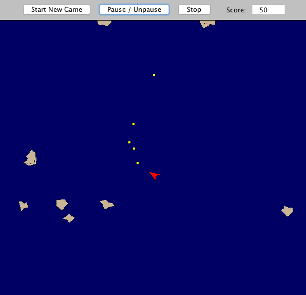

# Asteroid
First video game project created in Java for Object-Oriented Programming.

# The Game

The world has run out of coffee, and only you can save it.

You are a spaceship operator and have been sent out to extract coffee beans from extraterrestrial Arabica plants. If you don't get them soon the planet will suffer from coffee withdrawal. That means low levels of productivity and extreme levels of passive-aggressiveness!

Things were going fine... until the Asteroids showed up.
Hold off as long as possible and destroy as many of them as you can. Don't let your planet down.

> Up Arrow    -> Move Forward

> Left Arrow  -> Turn counterclockwise

> Right Arrow -> Turn clockwise

> Spacebar    -> Shoot Arabica seeds (as substitute for real missiles)

# Execution Instructions

Download the zip file.

In the command-line:
  Navigate to Asteroid-master:
  > (On Macs: cd downloads --> cd Asteroid-master)
  
  To start the game:
  > java -jar AsteroidGame.jar

